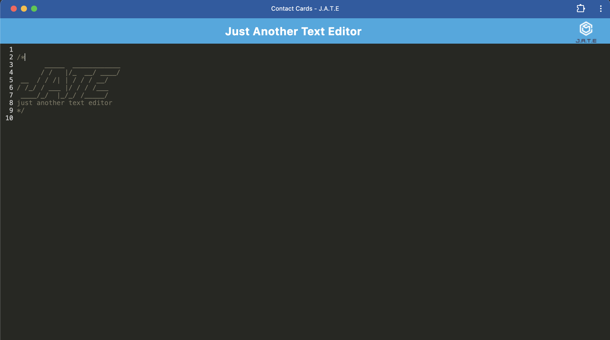

# PWA-Text-Editor

## Table of Contents
- [Description](#description) 
- [Installation](#installation)
- [Usage](#usage)
- [Contributing](#contributing)
- [Test](#test)
- [Contact](#contact)
 

  ## Description

  The purpose of this project isto build a text editor that runs in the browser.  It will also be able to function offline.

   

   Deployed  site: https://pwa-text-editor-kxcc.onrender.com
  

  ## Installation

  To install, clone Github repository and install on local machine.
  
  ## Usage

  The technologies used were Express.js for routing, indexedDB for the database, and the idb package.

  ## Contributing
  Jorge Guzman

  
  ## Contact
  Email: jguzman913@gmail.com

  Github: https://github.com/JGuzman8

